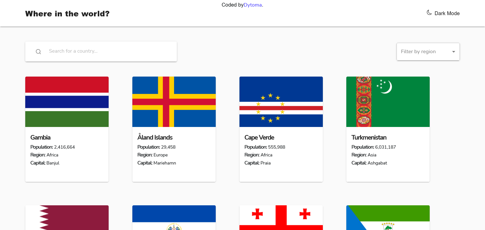
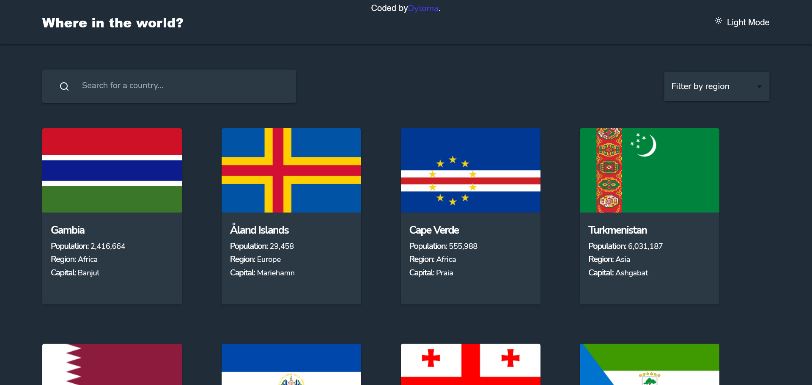
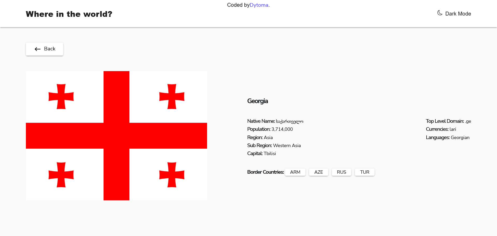
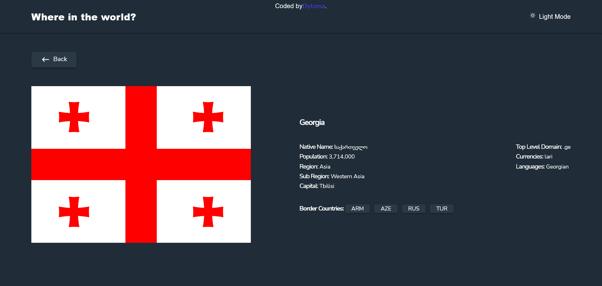

# Frontend Mentor - REST Countries API with color theme switcher solution

This is a solution to the [REST Countries API with color theme switcher challenge on Frontend Mentor](https://www.frontendmentor.io/challenges/rest-countries-api-with-color-theme-switcher-5cacc469fec04111f7b848ca). Frontend Mentor challenges help you improve your coding skills by building realistic projects. 

## Table of contents

- [Overview](#overview)
  - [The challenge](#the-challenge)
  - [Screenshot](#screenshot)
  - [Links](#links)
- [My process](#my-process)
  - [Built with](#built-with)
  - [What I learned](#what-i-learned)
  - [Dependencies](#dependencies)
- [Author](#author)
- [Acknowledgments](#acknowledgments)


## Overview

This website gives you all the information about all the countries in the world with the option to view more details for each country, to search for a specific country and then to see all the countries of a specific region. This site is responsive with beautiful animations.

### The challenge

Users should be able to:

- See all countries from the API on the homepage
- Search for a country using an `input` field
- Filter countries by region
- Click on a country to see more detailed information on a separate page
- Click through to the border countries on the detail page
- Toggle the color scheme between light and dark mode *(optional)*

### Screenshot






These are some screenshots of the final website.

### Links

- Solution URL: [Solution URL here](https://your-solution-url.com)
- Live Site URL: [Live site URL here](https://your-live-site-url.com)

## My process

I used rapid Api extension on vs code to test the different endpoints of the api and then used Axios to retrieve that data and use it in my solution.

### Built with

- Semantic HTML5 markup
- CSS custom properties
- Flexbox
- CSS Grid
- Mobile-first workflow
- [React](https://reactjs.org/) - JS library
- [Vite](https://vitejs.dev/guide/) - React framework
- [Framer motion](https://www.framer.com/motion/) - For animations
- [Material UI](https://mui.com/material-ui/getting-started/overview/) - For styles
- [React router dom](https://reactrouter.com/en/main) - For multiple pages
- [React icons](https://react-icons.github.io/react-icons//) - For icons


### What I learned

In this project, I learned about ```Object.values``` method which I was confusing with the ```Object.keys```.

### Dependencies

- `axios`
- `react`
- `react-dom`
- `react-router-dom`
- `framer-motion`
- `react-icons`
- `@mui/material`

To install all the dependencies, you can run ```npm install``` in your terminal on your local machine.


## Author

- Frontend Mentor - [@Dytoma](https://www.frontendmentor.io/profile/Dytoma)
- Twitter - [@OmarDytoma](https://www.twitter.com/OmarDytoma)

## Acknowledgments

Thanks to Alex Marshall who helped me in the frontend mentor slack community to fix some errors I was getting. 
